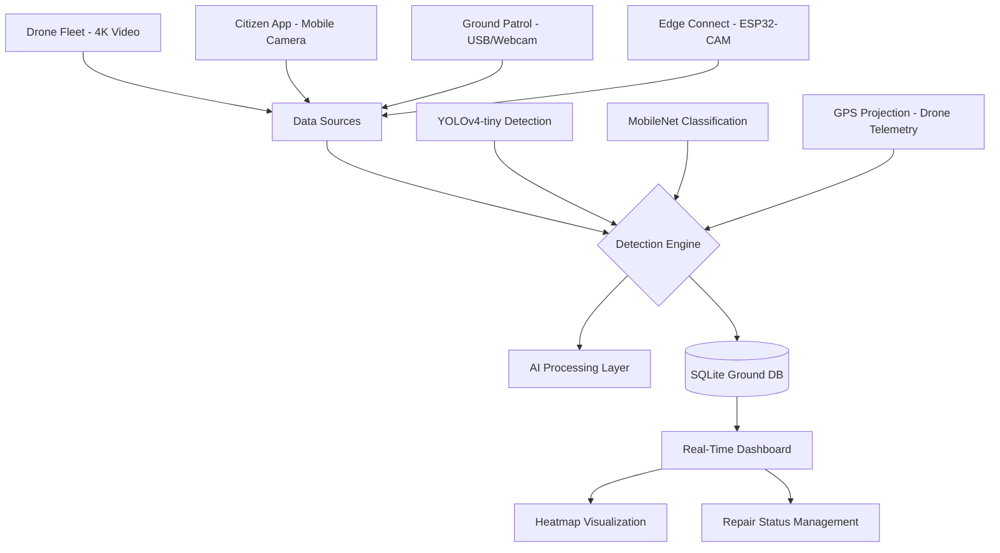

# 🚨 ASTROPATH - Smart Road Damage Detection & Rapid Response System

**Automated Smart Technology for Road Observation, Planning, Analysis, Tracking & Healing**

[](LICENSE)
[]()
[]()

---

### 📺 Live Demo

*Dashboard: Real-time pothole mapping and severity analysis.*

---

## 🏗️ The Project Vision

### ⚠️ The Problem
Traditional road maintenance relies on manual inspections or reactive citizen complaints, which are slow, inconsistent, and often too late. This leads to:
*   **Safety Hazards:** Undetected potholes cause thousands of accidents and vehicle damages daily.
*   **Infrastructure Costs:** Minor road damages grow into major craters if not caught early, increasing repair costs by 10x.
*   **Traffic Congestion:** Road repairs often happen during peak hours due to lack of predictive data.

### 💡 The Solution: ASTROPATH
**ASTROPATH** is an end-to-end AI ecosystem that automates the entire road lifecycle—from detection to repair tracking. By combining **Aerial Drones**, **IoT Edge Devices**, and **Mobile Citizen Reporting**, we create a real-time, high-accuracy digital twin of the city's road conditions.

*   **Drones:** Survey 20x faster than ground vehicles with 4K computer vision.
*   **Edge AI:** Real-time YOLOv4-tiny detection running on simple Raspberry Pi or ESP32-CAM.
*   **Smart Dashboard:** A centralized "War Room" for municipal authorities to prioritize repairs based on severity and location.

---

## �️ System Architecture



---

## 💻 Tech Stack

| Layer | Technology |
| :--- | :--- |
| **Backend** | Python, Flask, Waitress (WSGI) |
| **Frontend** | Vanilla JS, Leaflet.js (Maps), CSS3 (Dark Theme) |
| **Computer Vision** | OpenCV, YOLOv4-tiny, MobileNetV2 |
| **Drone Pipeline** | Pymavlink, DroneKit, RTSP/UDP Stream |
| **Database** | SQLite3 |
| **Edge/IoT** | ESP32-CAM, GPS NEO-6M |
| **Deployment** | Docker, Render Blueprints |

---

## 🎯 Key Features

## �🚀 Quick Start (30 Seconds!)

### Windows
```powershell
.\start.ps1
```

### Linux/Mac
```bash
./start.sh
```

**Then open:** http://localhost:5000

---

## ✨ Features

### 🎥 Multi-Source Detection
- ✅ Webcam (built-in or USB)
- ✅ ESP32-CAM (wireless)
- ✅ Phone camera (mobile browser)
- ✅ **Drone video stream** (RTSP/UDP/HTTP)
- ✅ Video files (post-processing)

### 🛰️ GPS & Location
- ✅ IP-based geolocation (no hardware)
- ✅ GPS module support (u-blox, NEO-6M)
- ✅ Phone GPS (from mobile browser)
- ✅ **Drone telemetry** (MAVLink)

### 🔍 AI Detection
- ✅ YOLOv4-tiny object detection
- ✅ MobileNetV2 classification
- ✅ Severity estimation (Low/Medium/High)
- ✅ Confidence scoring
- ✅ **Ground GPS projection from drone**

### 🌐 Web Interface
- ✅ Live video feed with detection
- ✅ Interactive map (Leaflet.js)
- ✅ Heatmap visualization
- ✅ Citizen reporting
- ✅ RESTful API
- ✅ Mobile-responsive design

---

## 📋 What You Need

### Required
- Python 3.8+
- Webcam or video source
- Internet connection (for model download)

### Optional
- GPS module (for precise location)
- ESP32-CAM (for wireless camera)
- Drone with video streaming
- CUDA-enabled GPU (for faster processing)

---

## 🏗️ Project Structure

```
ASTROPATH-1/
├── app.py                  # Main web application
├── main.py                 # CLI interface with menu
├── config.py               # Configuration settings
├── requirements.txt        # Python dependencies
│
├── start.ps1              # Windows quick start
├── start.sh               # Linux/Mac quick start
│
├── src/                   # Source code
│   ├── detect_edge.py     # Edge detection module
│   ├── drone_detector.py  # Drone detection
│   ├── drone_controller.py # Drone video & telemetry
│   ├── gps_handler.py     # GPS integration
│   ├── database.py        # Database operations
│   ├── dashboard.py       # Web dashboard
│   ├── citizen_upload.py  # Citizen reporting
│   └── esp32_camera.py    # ESP32-CAM support
│
├── templates/             # HTML templates
│   ├── index.html        # Main interface
│   └── dashboard.html    # Map dashboard
│
├── static/               # CSS/JS files
│   ├── css/style.css
│   └── js/*.js
│
├── models/               # AI models
│   ├── yolov4-tiny.weights (download required)
│   ├── yolov4-tiny.cfg
│   └── obj.names
│
├── Dockerfile            # Docker container
├── docker-compose.yml    # Docker Compose setup
│
└── Documentation/
    ├── README.md         # This file
    ├── DEPLOY_GUIDE.md   # Deployment guide
    ├── DRONE_GUIDE.md    # Drone setup
    ├── ESP32_CAM_SETUP.md
    └── GPS_SETUP_GUIDE.md
```

---

## 🎯 Usage Modes

### 1. Web Application (Recommended)

```bash
python app.py
```
- **Main page:** http://localhost:5000
- **Dashboard:** http://localhost:5000/dashboard
- Features: Live detection, citizen reporting, map view

### 2. Interactive Menu

```bash
python main.py
```
Choose from:
1. Train classifier
2. Run edge detection
3. Start dashboard
4. Citizen reporting app
5. Configure settings
6. Test GPS
7. Test ESP32-CAM
8. Test API

### 3. Drone Mode

```bash
# Test stream first
python test_drone_stream.py

# Run detection
python src/drone_detector.py
```

### 4. Command Line Detection

```bash
# With webcam
python -c "from src.detect_edge import main; main()"

# With video file
# Set CAMERA_SOURCE in config.py to video path
```

---

## ⚙️ Configuration

Edit `config.py` to customize:

```python
# Camera source
CAMERA_SOURCE = 0  # 0=webcam, 1=USB, "URL"=stream

# Detection thresholds
CONF_THRESHOLD = 0.5  # Lower = more detections
NMS_THRESHOLD = 0.4

# GPS settings
GPS_ENABLED = False
GPS_PORT = 'COM3'  # Windows

# Drone settings
DRONE_ENABLED = False
DRONE_STREAM_URL = "rtsp://192.168.1.100:8554/video"

# Server settings
FLASK_HOST = "0.0.0.0"  # Allow network access
FLASK_PORT = 5000

# Performance
FAST_MODE = True
DETECTION_FRAME_SKIP = 2
```

---

## 🚁 Drone Support

ASTROPATH supports aerial road inspection with drones:

### Supported Drones
- DJI (Mavic 3, Mini 3 Pro, Air 2S, Phantom 4)
- Autel EVO II
- Skydio 2+
- Pixhawk/ArduPilot (custom drones)
- Any drone with RTSP/UDP video streaming

### Quick Start
```bash
# 1. Configure drone stream
DRONE_STREAM_URL = "rtsp://192.168.1.100:8554/video"

# 2. Test connection
python test_drone_stream.py

# 3. Run survey
python src/drone_detector.py
```

**See `DRONE_GUIDE.md` for complete drone setup instructions.**

---

## 📱 Mobile Access

Access from phone/tablet:

1. Start app on PC: `python app.py`
2. Find PC IP: `ipconfig` (Windows) or `ifconfig` (Linux)
3. On phone, open: `http://YOUR_PC_IP:5000`
4. Use phone camera to report potholes

---

## 🐳 Docker Deployment

```bash
# Quick deploy
docker-compose up -d

# Or build manually
docker build -t astropath .
docker run -p 5000:5000 astropath
```

---

## ☁️ Cloud Deployment

### Heroku
```bash
heroku create astropath-app
git push heroku main
```

### AWS/DigitalOcean/Linode
```bash
# SSH to server
git clone YOUR_REPO
cd ASTROPATH-1
./start.sh
```

**See `DEPLOY_GUIDE.md` for detailed instructions.**

---

## 📊 API Endpoints

| Endpoint | Method | Description |
|----------|--------|-------------|
| `/` | GET | Main web interface |
| `/dashboard` | GET | Map dashboard |
| `/api/detections` | GET | Get all detections |
| `/api/stats` | GET | Get statistics |
| `/api/location` | GET | Get current GPS |
| `/api/upload` | POST | Upload citizen report |
| `/health` | GET | Health check |

### Example API Usage

```python
import requests

# Get detections
response = requests.get('http://localhost:5000/api/detections?limit=10')
data = response.json()

# Upload report
files = {'image': open('pothole.jpg', 'rb')}
data = {'severity': 'High', 'latitude': 17.66, 'longitude': 75.90}
requests.post('http://localhost:5000/api/upload', files=files, data=data)
```

---

## 🔧 Advanced Setup

### Add GPS Module

1. Connect GPS via USB/Serial
2. Update `config.py`:
   ```python
   GPS_ENABLED = True
   GPS_PORT = 'COM3'  # or '/dev/ttyUSB0'
   ```
3. Test: `python test_gps.py`

### Add ESP32-CAM

1. Flash ESP32-CAM with code from `ESP32_CAM_SETUP.md`
2. Update `config.py`:
   ```python
   CAMERA_SOURCE = "http://192.168.1.100:81/stream"
   ```
3. Test: `python src/esp32_camera.py`

### Train Custom Model

```bash
# 1. Organize training data
data/training_images/
├── pothole/  (100+ images)
└── plain/    (100+ images)

# 2. Train
python src/train_classifier.py

# 3. Model saved to models/custom_classifier.h5
```

---

## 🐛 Troubleshooting

### Camera not working
```bash
# Test cameras
python -c "import cv2; print([cv2.VideoCapture(i).isOpened() for i in range(4)])"
```

### YOLO model missing
```
Download:
https://github.com/AlexeyAB/darknet/releases/download/darknet_yolo_v4_pre/yolov4-tiny.weights

Save to: models/yolov4-tiny.weights
```

### Port already in use
```powershell
# Windows
netstat -ano | findstr :5000
taskkill /PID <PID> /F

# Or change port in config.py
FLASK_PORT = 8000
```

### Low FPS
```python
# Optimize performance
FAST_MODE = True
FAST_IMG_SIZE_YOLO = 320
DETECTION_FRAME_SKIP = 3
```

---

## 📚 Documentation

| File | Description |
|------|-------------|
| `README.md` | This file - Overview & quick start |
| `START_HERE.md` | Detailed getting started guide |
| `DEPLOY_GUIDE.md` | Production deployment |
| `DRONE_GUIDE.md` | Drone integration |
| `ESP32_CAM_SETUP.md` | ESP32-CAM setup |
| `GPS_SETUP_GUIDE.md` | GPS configuration |
| `QUICK_START_3_STEPS.md` | Ultra-quick guide |

---

## 🎯 Use Cases

### Municipal Corporations
- Automated road surveys
- Citizen engagement platform
- Data-driven maintenance
- Budget optimization

### Research Institutions
- Road condition datasets
- ML model training
- Urban planning analysis

### Drone Service Providers
- Aerial road inspection
- Large area surveys
- Post-disaster assessment

---

## 🌟 System Capabilities

| Feature | Ground Vehicle | Citizen Mobile | Drone |
|---------|---------------|----------------|-------|
| Speed | 1x | N/A | 20x |
| Coverage | Limited | Point | Wide area |
| Automation | Yes | No | Yes |
| GPS Accuracy | High | Medium | High |
| Cost per km | Medium | Free | Low |
| Traffic Impact | High | None | None |

---

## 🤝 Contributing

Contributions welcome! Areas for enhancement:

- [ ] User authentication
- [ ] Mobile app (React Native)
- [ ] Advanced analytics
- [ ] Multi-language support
- [ ] Automated work orders
- [ ] Integration with GIS systems

---

## 📄 License

ASTROPATH - Smart Road Damage Reporting System
© 2026 Solapur Municipal Corporation

Open source for smart city initiatives.

---

## 👥 Team & Contact

**Lead:** Mallu Diswardhan Reddy  
**Email:** 438malludiswardhanreddy@gmail.com  
**Organization:** Solapur Municipal Corporation

---

## 🙏 Acknowledgments

- **YOLOv4-tiny:** AlexeyAB/Darknet
- **TensorFlow:** Google
- **OpenCV:** Open Source Computer Vision
- **Leaflet.js:** Interactive maps
- **Flask:** Web framework

---

## 🚀 Quick Commands Reference

```bash
# Start web app
python app.py

# Start with menu
python main.py

# Test drone stream
python test_drone_stream.py

# Test GPS
python test_gps.py

# Train model
python src/train_classifier.py

# Docker deploy
docker-compose up -d

# Windows quick start
.\start.ps1

# Linux quick start
./start.sh
```

---

**Made with ❤️ for Smart Cities**

**ASTROPATH** - Automated Smart Technology for Road Observation, Planning, Analysis, Tracking & Healing

🚗 Ground Vehicles | 📱 Citizens | 🚁 Drones | 🌐 Real-time Dashboard
