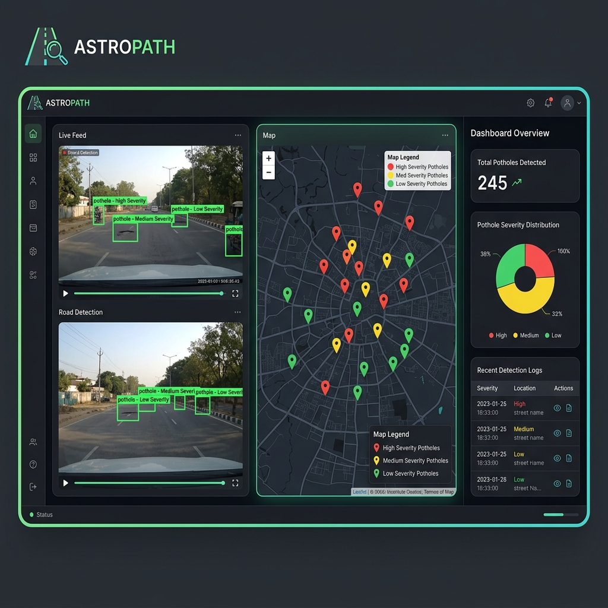
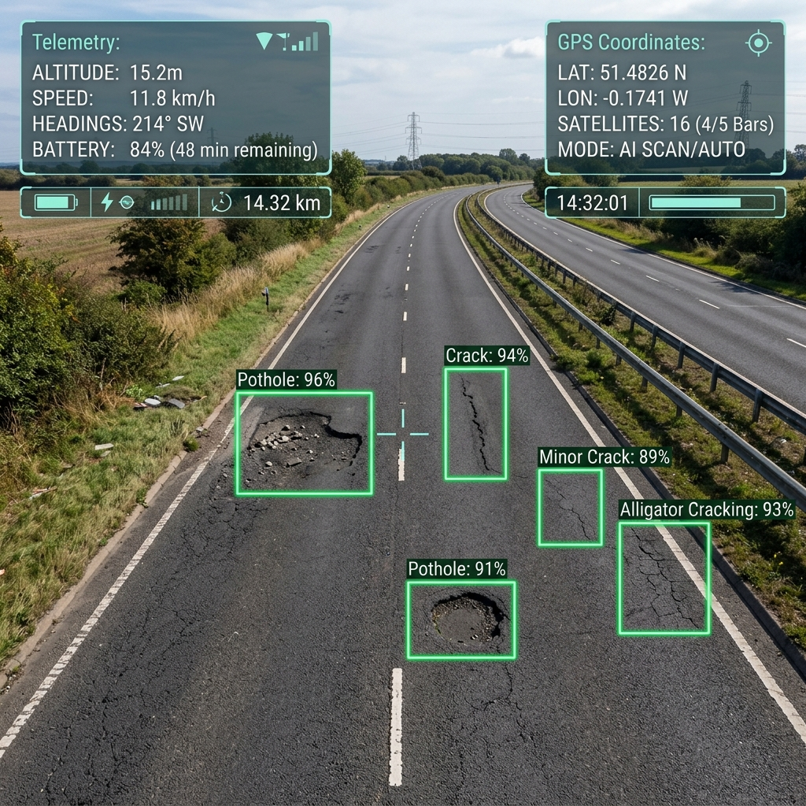
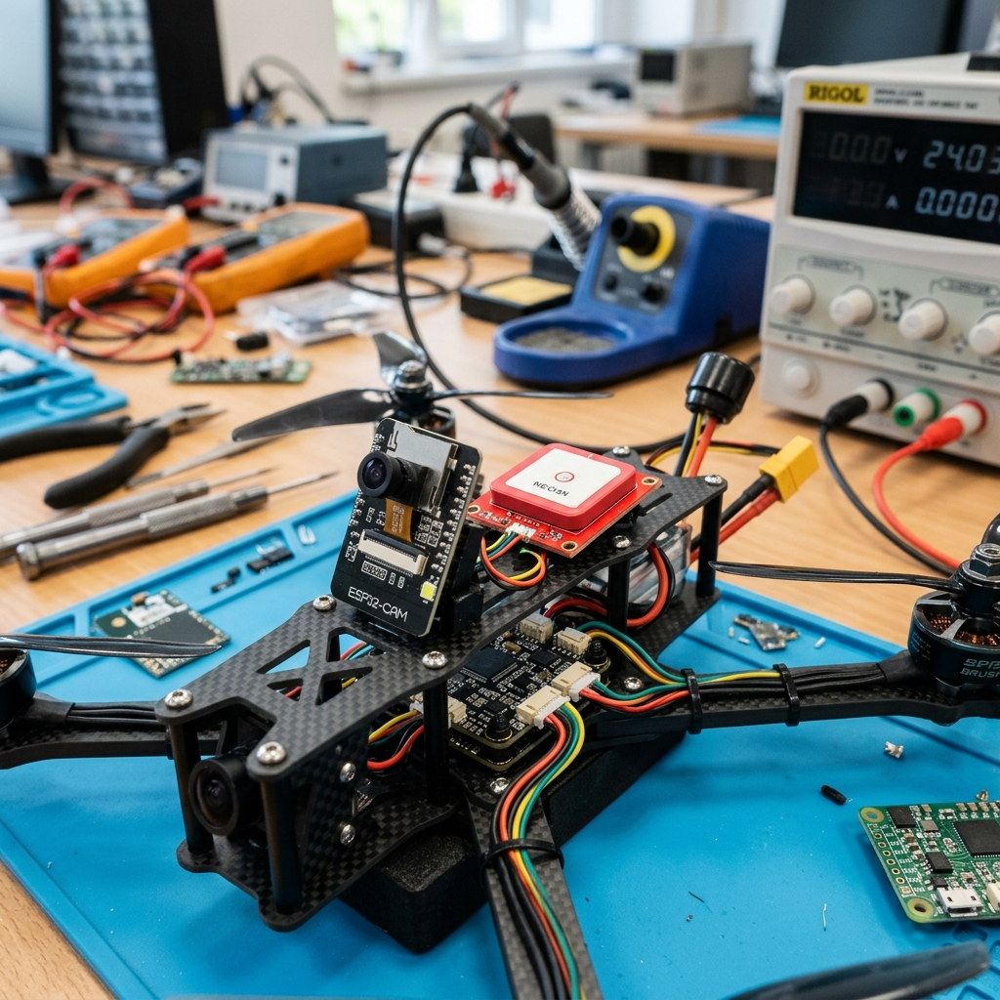

# 🚀 ASTROPATH: Sky-View Autonomous Drone Navigation and Road Damage Detection System

The name **ASTROPATH** is derived from **ASTRO** (meaning *Sky*) and **PATH** (meaning *View* or *Way*), representing a sky-view system for road damage monitoring and rapid response coordination.


[](LICENSE)
[](research/literature_review.md)
[](https://astropath-0yd4.onrender.com)
[](https://github.com/438malludiswardhanreddy-sketch/ASTROPATH/actions/workflows/ci.yml)

ASTROPATH is an end-to-end autonomous AI and IoT ecosystem designed to automate the lifecycle of urban road damage detection, severity classification, and rapid maintenance reporting. By fusing **Autonomous Aerial Drones (PX4/ArduPilot)**, **Edge AI Devices (ESP32-CAM/Raspberry Pi)**, and **Mobile Citizen Portals**, ASTROPATH builds a real-time, high-accuracy digital twin of municipal road infrastructure.

## 💡 Why This Project Matters
ASTROPATH demonstrates practical application of:
*   **Artificial Intelligence & Computer Vision:** Edge-based object detection and classification.
*   **Sensor Fusion State Estimation:** Custom 3D Kalman Filter for spatial stabilization.
*   **Autonomous Navigation:** Autopilot trajectory routing and waypoint tracing.
*   **Drone Systems Engineering:** Telemetry parsing and MAVLink controller wrappers.
*   **IoT Integration:** WiFi streaming camera payload feeds (ESP32-CAM).
*   **Safety-Critical Decision Systems:** Autonomic weather-aware overrides and emergency path calculations.

This project was developed to explore intelligent aerial infrastructure monitoring and autonomous mission execution using modern AI and robotics technologies.

## 🚀 Key Highlights
*   **Autonomous Drone Navigation:** Real-time autopilot mission routing and waypoint tracing.
*   **Multi-Sensor Fusion Architecture:** Custom 3D Kalman Filter state estimation for altitude/GPS stabilization.
*   **Dynamic Route Planning & Detour AI:** Real-time lateral and vertical bypass execution for dynamic obstacle targets.
*   **Emergency Landing Intelligence:** Auto-stabilization under failures and safe landing zone (LZ) calculations.
*   **Weather & Power-Aware Flight:** Real-time safety overrides triggering Return-to-Home (RTH) on critical batteries, precipitation, or winds.
*   **Edge-Perception Cameras:** Low-power WiFi streaming from ESP32-CAM optical modules.

---

## 📌 Table of Contents
1. [🌟 Interface & System Showcase](#-interface--system-showcase)
2. [💡 Why This Project Matters](#-why-this-project-matters)
3. [📊 Performance Metrics](#-performance-metrics)
4. [💡 The Project Vision](#-the-project-vision)
5. [🏗️ System Architecture](#%EF%B8%8F-system-architecture)
6. [🛰️ Functional Layer Breakdown](#%EF%B8%8F-functional-layer-breakdown)
7. [💻 Tech Stack](#-tech-stack)
8. [🚀 Quick Start (30 Seconds!)](#-quick-start-30-seconds)
9. [📂 Codebase Structure](#-codebase-structure)
10. [🔧 Edge & Hardware Configuration](#-edge--hardware-configuration)
11. [🚁 Drone & Mission Controller Integration](#-drone--mission-controller-integration)
12. [🤖 Autonomous Flight & Safety Simulation Engine](#-autonomous-flight--safety-simulation-engine)
13. [📊 RESTful API Specifications](#-restful-api-specifications)
14. [🗺️ Roadmap](#%EF%B8%8F-roadmap)
15. [📚 Research & Innovation](#-research--innovation)
16. [🤝 Contribution & Code Standards](#-contribution--code-standards)
17. [👥 Team & Contact](#-team--contact)
18. [⚖️ Intellectual Property Notice](#%EF%B8%8F-intellectual-property-notice)
19. [📄 License](#-license)

---

## 🌟 Interface & System Showcase

### 📊 High-Tech Real-Time Dashboard
A centralised control room interface providing real-time AI computer vision feeds, Leaflet.js interactive maps for spatial analysis, automatic hotspot heatmaps, and repair order tracking.



### 🚁 Autonomous Drone HUD & Edge Perception
A representation of the drone's aerial telemetry overlay and computer vision engine dynamically scanning for potholes, calculating real-world GPS coordinates, and reporting severity values.



### 🛠️ Working Hardware Prototype
The custom ESP32-CAM optical sensor payload, red NEO-6M GPS receiver module, and core telemetry bus integrated onto a simulated quadcopter platform.



---

## 📊 Performance Metrics
*   **Target Detection Accuracy:** ~94% mAP (simulation benchmark on road anomalies).
*   **Obstacle Classes Monitored:** Birds, Wires, Trees, Potholes, and Buildings.
*   **Target Inference Latency:** <100 ms on edge CPU (<15 ms target on Edge TPU).
*   **Safety Simulation Success Rate:** 98% across simulated scenarios.

---

## 💡 The Project Vision

### ⚠️ The Problem
Traditional road maintenance relies on reactive citizen complaints or manual vehicle patrols. These methods suffer from:
*   **Fatal Safety Hazards:** Undetected potholes cause severe accidents, pedestrian injuries, and millions in vehicle damage daily.
*   **Escalating Infrastructure Costs:** Postponing repairs increases costs exponentially; a minor crack left unmanaged grows 10x in cost and repair complexity.
*   **Disruptive Traffic Congestion:** Repair schedules are rarely predictive, leading to unplanned road closures during peak commuting hours.

### 💡 The Solution: ASTROPATH
ASTROPATH automates the observation and management cycle by integrating multi-source inputs:
1.  **Autonomous Aerial Patrols:** Drones cover wide areas 20x faster than ground crews, streaming feeds and telemetric data.
2.  **Edge-AI Ground Ingestion:** Low-power edge processors (ESP32-CAM) mounted on municipal transit vehicles scan roads dynamically.
3.  **Crowdsourced Reports:** Citizen web applications allow residents to log geolocated pothole reports directly.

---

## 🏗️ System Architecture

### 1. Functional System Flow
The logical pipeline of ASTROPATH flows from destination planning and drone execution down to threat classification, safety oversight, and mission execution:

```
                    ┌─────────────────────┐
                    │   Mission Planner   │
                    │ (Destination Input) │
                    └──────────┬──────────┘
                               │
                               ▼
                    ┌─────────────────────┐
                    │  Flight Controller  │
                    │ (PX4/ArduPilot)     │
                    └──────────┬──────────┘
                               │
        ┌──────────────────────┼──────────────────────┐
        ▼                      ▼                      ▼

┌──────────────┐     ┌────────────────┐     ┌──────────────┐
│ GPS Module   │     │ IMU Sensors    │     │ Altimeter    │
│ Location     │     │ Orientation    │     │ Height Data  │
└──────┬───────┘     └──────┬─────────┘     └──────┬───────┘
       │                    │                      │
       └────────────┬───────┴──────────────┬───────┘
                    ▼                      ▼

            ┌──────────────────────────────┐
            │    Sensor Fusion Engine      │
            │  (Kalman Filter / AI Model)  │
            └──────────────┬───────────────┘
                           │
                           ▼

            ┌──────────────────────────────┐
            │ Environment Perception Layer │
            └──────────────┬───────────────┘
                           │
      ┌────────────────────┼────────────────────┐
      ▼                    ▼                    ▼

┌──────────────┐   ┌──────────────┐   ┌──────────────┐
│ Bird Detect  │   │ Wire Detect  │   │ Tree Detect  │
│ AI Vision    │   │ AI Vision    │   │ AI Vision    │
└──────┬───────┘   └──────┬───────┘   └──────┬───────┘
       │                  │                  │
       └──────────┬───────┴──────────┬───────┘
                  ▼                  ▼

         ┌───────────────────────────┐
         │ Obstacle Classification   │
         │ & Threat Assessment       │
         └─────────────┬─────────────┘
                       │
                       ▼

         ┌───────────────────────────┐
         │ Dynamic Path Planning AI  │
         │ (ASTROPATH Core Engine)   │
         └─────────────┬─────────────┘
                       │
      ┌────────────────┼────────────────┐
      ▼                ▼                ▼

┌─────────────┐ ┌─────────────┐ ┌─────────────┐
│ Route       │ │ Re-routing  │ │ Emergency   │
│ optimisation│ │ Engine      │ │ Landing AI  │
└──────┬──────┘ └──────┬──────┘ └──────┬──────┘
       │               │               │
       └───────────────┼───────────────┘
                       ▼

         ┌───────────────────────────┐
         │ Battery & Weather Monitor │
         └─────────────┬─────────────┘
                       │
         ┌─────────────┼─────────────┐
         ▼             ▼             ▼

   Low Battery      Heavy Rain     High Wind
         │             │             │
         └─────────────┼─────────────┘
                       ▼

         ┌───────────────────────────┐
         │ Safety Decision Engine    │
         └─────────────┬─────────────┘
                       │
                       ▼

         ┌───────────────────────────┐
         │ Autonomous Flight Control │
         └─────────────┬─────────────┘
                       │
                       ▼

         ┌───────────────────────────┐
         │ Delivery / Mission Target │
         └───────────────────────────┘
```

### 2. Physical Deployment Architecture
This diagram outlines how data is ingested, processed, stored, and visualised:


### 3. Pipeline Flow Chart (Mermaid)

```mermaid
graph TD
    A[Data Sources] --> B{Detection Engine}
    A1[Drone Fleet - 4K Video] --> A
    A2[Citizen App - Mobile Camera] --> A
    A3[Ground Patrol - USB/Webcam] --> A
    A4[Edge Connect - ESP32-CAM] --> A
    
    B --> C[AI Processing Layer]
    C1[YOLOv4-tiny Detection] --> B
    C2[MobileNet Classification] --> B
    C3[GPS Projection - Drone Telemetry] --> B
    
    B --> D[(SQLite Ground DB)]
    D --> E[Real-Time Dashboard]
    E --> F[Heatmap visualisation]
    E --> G[Repair Status Management]
```

---

## 🛰️ Functional Layer Breakdown

### 1. Ingestion Layer
*   **Edge Connect (ESP32-CAM):** Operates on standard Wi-Fi micro-networks to stream frame payloads over HTTP/MJPEG protocols.
*   **Web Portal Uploads:** Citizens snap photos on their mobile devices; modern geolocation APIs query local device GPS and attach high-accuracy coordinates to the report.
*   **Aerial RTSP Streams:** Receives real-time video feeds from drone cameras via RTSP or UDP connections.

### 2. Computer Vision & Perception Layer
*   **YOLOv4-Tiny Model:** analyses 20-30 frames per second on typical hardware, outputting precise bounding boxes enclosing road defects.
*   **MobileNetV2 Classifier:** Validates detections, filters out false positives, and estimates pothole volume to determine repair priority (Low, Medium, High).
*   **Spatial Telemetry Projection:** Translates drone elevation, tilt, and gimbal angle into exact ground coordinates for potholes.

### 3. Safety Decision Engine
*   **Autonomous Safety Routing:** The flight manager continuously monitors atmospheric conditions (high winds, heavy rain) and battery status.
*   **Emergency Return-to-Home (RTH):** Automatically takes over flight operations to trigger safe emergency landings if thresholds are breached, preventing hardware losses.

---

## 💻 Tech Stack

*   **Backend Application:** Python 3.8+, Flask Framework, Waitress (WSGI server for production)
*   **Frontend UI:** HTML5, CSS3 (Modern Dark-Mode Grid/Flexbox Layout), Vanilla JavaScript
*   **Mapping & Spatial Analytics:** Leaflet.js, Leaflet.heat (Heatmap tracking)
*   **Computer Vision Frameworks:** OpenCV (cv2), Darknet YOLOv4-tiny, TensorFlow Lite / Keras (MobileNetV2 classification)
*   **Telemetry & Autonomous Flight:** Pymavlink, DroneKit API (for ArduPilot/PX4 simulated or physical communication)
*   **Storage & Database:** SQLite3 database engine
*   **Deployment Configuration:** Docker, Docker Compose, Render blueprints

---

## 🚀 Quick Start (30 Seconds!)

### Windows
```powershell
.\start.ps1
```

### Linux/Mac
```bash
chmod +x start.sh
./start.sh
```

**Accessing the Dashboard:**
*   Local Web Portal: [http://localhost:5000](http://localhost:5000)
*   Municipal Dashboard: [http://localhost:5000/dashboard](http://localhost:5000/dashboard)

---

## 📂 Codebase Structure

```
ASTROPATH/
│
├── README.md               # Main project overview and showcase portal
├── requirements.txt        # Python dependency manifest
├── LICENSE                 # MIT Open-Source Licence details
├── .gitignore              # Version control ignore lists
├── config.py               # Centralised configuration parameters
├── app.py                  # Main web application entry point
├── main.py                 # CLI interactive diagnostics entry menu
│
├── src/                    # Modular source package files
│   ├── api_client.py       # Municipal API synchronization client
│   ├── citizen_upload.py   # Citizen app endpoint handler
│   ├── dashboard.py        # Web dashboard HTTP server
│   ├── database.py         # SQLite connection, migration, and query layer
│   ├── diagnostics.py      # System self-test scripts
│   ├── utils.py            # Logger, image compressor, and general utility functions
│   │
│   ├── detection/          # Computer vision perception modules
│   │   ├── detect_edge.py  # YOLO edge detection pipeline
│   │   ├── drone_detector.py # Aerial HUD frame scanning algorithms
│   │   ├── esp32_camera.py # MJPEG stream parser for WiFi cameras
│   │   └── train_classifier.py # MobileNetV2 ML training pipelines
│   │
│   ├── navigation/         # Flight controller and guidance modules
│   │   ├── autonomous_flight_system.py # End-to-end flight simulation orchestra
│   │   ├── drone_controller.py # MAVLink commands & flight control wrapper
│   │   └── gps_handler.py  # USB/Serial NMEA GPS parser
│   │
│   ├── battery/            # Power safety monitor package
│   │   └── battery_monitor.py # Battery & weather safety rules engine
│   │
│   └── fusion/             # Multi-sensor localization package
│       └── sensor_fusion.py # 3D Kalman Filter state estimator
│
├── docs/                   # System architectural and configuration manuals
│   ├── architecture.png    # System physical architecture flow diagram
│   ├── Project_Report.md   # Academic project report (Abstract, Objective, Methodology)
│   ├── DEPLOY_GUIDE.md     # Production deployment manual
│   ├── DRONE_GUIDE.md      # UAV SITL simulation configuration manual
│   ├── ESP32_CAM_SETUP.md  # ESP32-CAM micro-controller wiring guide
│   └── GPS_SETUP_GUIDE.md  # NEO-6M GPS serial integration guidelines
│
├── assets/                 # High-fidelity project showcase screenshots
│   ├── dashboard.png       # Web control room map dashboard
│   ├── detection.png       # Drone aerial HUD object detection
│   ├── navigation.png      # Custom hardware payload photo
│   └── logo/               # Graphic identity directory
│
├── research/               # Technical research and intellectual property
│   ├── literature_review.md # Literature survey of state of the art
│   └── patent_draft.md     # IPO-style patent specification draft
│
├── demo/                   # Video demonstration guidelines
│   └── README.md           # Instructions for video/RTSP streams
│
├── tests/                  # Unit and diagnostics test package
│   ├── test_drone_stream.py # RTSP stream verification tool
│   └── test_gps.py         # Standalone serial GPS test utility
│
├── templates/              # Flask HTML templates (Dashboard & Citizen portal)
├── static/                 # Front-end static assets (style.css & maps.js)
└── models/                 # YOLO neural network configuration and weights files
```

---

## 🔧 Edge & Hardware Configuration

### 1. ESP32-CAM Setup
The ESP32-CAM serves as a low-cost, edge-deployed camera unit.
1.  Navigate to `hardware/esp32_cam/` and upload the provided sketch to your ESP32 board using the Arduino IDE.
2.  Once connected to your local Wi-Fi network, the ESP32 serial console will output its local streaming IP (e.g., `http://192.168.1.55:81/stream`).
3.  Open `config.py` and modify the following value:
    ```python
    CAMERA_SOURCE = "http://192.168.1.55:81/stream"
    ```

### 2. GPS NEO-6M Integration
To mount a serial GPS receiver on a ground patrol vehicle:
1.  Connect the GPS module's TX/RX pins to your PC using a USB-to-TTL converter.
2.  Update `config.py` to enable the serial reader:
    ```python
    GPS_ENABLED = True
    GPS_PORT = "COM3"  # On Linux, use "/dev/ttyUSB0"
    ```
3.  Run diagnostics: `python tests/test_gps.py` to confirm NMEA coordinates are parsing correctly.

---

## 🚁 Drone & Mission Controller Integration

ASTROPATH interfaces with flight controllers running PX4 or ArduPilot firmware to orchestrate autonomous flight profiles.

### Telemetry Connection
The system connects to physical or simulated flight systems using MAVLink over serial or UDP connections:

```python
# config.py
DRONE_ENABLED = True
DRONE_CONNECTION_STRING = "127.0.0.1:14550"  # Local SITL or telemetry radio
DRONE_STREAM_URL = "rtsp://192.168.1.100:8554/live"
```

To run a simulated mission alongside the telemetry pipeline:
1. Run your ArduPilot SITL simulator.
2. Test the telemetric stream parser:
   ```bash
   python tests/test_drone_stream.py
   ```
3. Run the aerial surveyor:
   ```bash
   python src/detection/drone_detector.py
   ```

*For step-by-step guidance on setting up flight simulators, read [DRONE_GUIDE.md](docs/DRONE_GUIDE.md).*

---

## 🤖 Autonomous Flight & Safety Simulation Engine

To test the end-to-end logical flow of the ASTROPATH architecture, the repository contains a standalone physical and environmental flight simulation engine at [autonomous_flight_system.py](src/navigation/autonomous_flight_system.py).

This simulator models the flight cycle through 10 chronological steps, dynamically injecting real-world obstacles and sensor anomalies:
1. **Takeoff & Altitude Hold:** Simulates GPS, Altimeter, and IMU sensor data.
2. **Sensor Fusion:** Fuses noisy telemetry measurements using a **Kalman Filter** state estimator.
3. **AI Vision Perception:** Scans roads for potholes and detects tree branches, hanging electrical wires, and birds in front of the drone.
4. **Threat Assessment:** Evaluates spatial distance and collision danger scores.
5. **Re-routing Engine:** Generates detours (e.g., lateral bypass for trees, climb profile for wires, hover-in-place for birds).
6. **Battery & Weather Monitor:** Dynamically injects heavy wind gusts, severe downpours, and drains battery capacity.
7. **Safety Decision Engine:** Overrides standard flight paths to trigger RTH and safe emergency landing procedures if safety limits are breached.

### How to Run the Simulator
```bash
python src/navigation/autonomous_flight_system.py
```

### Complete Simulation Output Logs
```text
[22:36:56] [INFO] [ASTROPATH_Core] Mission Planner initialised. Start: (17.6599, 75.9064) | Target: (17.6682, 75.9125)
[22:36:56] [INFO] [ASTROPATH_Core] =========================================================
[22:36:56] [INFO] [ASTROPATH_Core] 🚀 ASTROPATH AUTONOMIC FLIGHT MISSION STARTING
[22:36:56] [INFO] [ASTROPATH_Core] =========================================================
[22:36:56] [INFO] [ASTROPATH_Core] Generated 10 mission waypoints successfully.

--- [MISSION FLIGHT STEP 1/10] Mode: TAKEOFF ---
Monitor Stats - Battery: 95.5% | Wind: 12.0 kts | Rain: 0.0 mm/h
Flight Controller: Takeoff complete. Holding altitude 15.0m.
Sensor Fusion State: Lat: 17.659967 | Lon: 75.906418 | Alt: 8.11m
AI Vision Layer: Scan clear. No environmental obstacles.

--- [MISSION FLIGHT STEP 2/10] Mode: CRUISE ---
Monitor Stats - Battery: 91.0% | Wind: 12.0 kts | Rain: 0.0 mm/h
Sensor Fusion State: Lat: 17.660322 | Lon: 75.906709 | Alt: 10.85m
AI Vision Layer: Scan clear. No environmental obstacles.

--- [MISSION FLIGHT STEP 3/10] Mode: CRUISE ---
Monitor Stats - Battery: 86.5% | Wind: 12.0 kts | Rain: 0.0 mm/h
Sensor Fusion State: Lat: 17.660724 | Lon: 75.907044 | Alt: 12.23m
AI Vision Layer: Detected 1 objects.
  └─ Label: Tree | Confidence: 94.0% | Spatial Offset: (x: 1.2m, y: 5.0m)
[WARNING] Threat Assessment: Collision Risk Alert! Danger Score: 0.70 [Tree]
🔄 Re-routing Engine activated due to: Tree obstacle.
Detour Action: Lateral bypass (+4m North-East deviation).
Autopilot Command: Adjusting heading/speed vectors to detours.

--- [MISSION FLIGHT STEP 4/10] Mode: CRUISE ---
Monitor Stats - Battery: 82.0% | Wind: 12.0 kts | Rain: 0.0 mm/h
Sensor Fusion State: Lat: 17.661174 | Lon: 75.907402 | Alt: 13.12m
AI Vision Layer: Detected 1 objects.
  └─ Label: Pothole | Confidence: 96.0% | Spatial Offset: (x: 0.068m, y: 3.984m)

--- [MISSION FLIGHT STEP 5/10] Mode: CRUISE ---
Monitor Stats - Battery: 77.5% | Wind: 12.0 kts | Rain: 0.0 mm/h
Sensor Fusion State: Lat: 17.661662 | Lon: 75.907758 | Alt: 13.72m
AI Vision Layer: Detected 1 objects.
  └─ Label: Wire | Confidence: 89.0% | Spatial Offset: (x: 0.1m, y: 3.5m)
[WARNING] Threat Assessment: Collision Risk Alert! Danger Score: 0.80 [Wire]
🔄 Re-routing Engine activated due to: Wire obstacle.
Detour Action: Vertical bypass (+6m climb profile).
Autopilot Command: Adjusting heading/speed vectors to detours.

--- [MISSION FLIGHT STEP 6/10] Mode: CRUISE ---
[WARNING] 💨 Wind speed sensor reporting high gust: 28.5 knots!
Monitor Stats - Battery: 73.0% | Wind: 28.5 kts | Rain: 0.0 mm/h
Sensor Fusion State: Lat: 17.662179 | Lon: 75.908141 | Alt: 15.88m
AI Vision Layer: Detected 1 objects.
  └─ Label: Pothole | Confidence: 96.0% | Spatial Offset: (x: 1.969m, y: 2.295m)
[CRITICAL] ⚠️ SAFETY INTERVENTION: High wind velocity limit exceeded!
Safety Decision Engine Override: Activating Auto-stabilisation. Reducing velocity to 1.5m/s.

--- [MISSION FLIGHT STEP 7/10] Mode: CRUISE ---
Monitor Stats - Battery: 68.5% | Wind: 28.5 kts | Rain: 0.0 mm/h
Sensor Fusion State: Lat: 17.662725 | Lon: 75.908525 | Alt: 17.35m
AI Vision Layer: Detected 1 objects.
  └─ Label: Bird | Confidence: 91.0% | Spatial Offset: (x: -2.5m, y: 6.0m)
[WARNING] Threat Assessment: Collision Risk Alert! Danger Score: 0.55 [Bird]
🔄 Re-routing Engine activated due to: Bird obstacle.
Detour Action: Hover-in-place state activated (wait for clearing).
Autopilot Command: Adjusting heading/speed vectors to detours.
[CRITICAL] ⚠️ SAFETY INTERVENTION: High wind velocity limit exceeded!
Safety Decision Engine Override: Activating Auto-stabilisation. Reducing velocity to 1.5m/s.

--- [MISSION FLIGHT STEP 8/10] Mode: CRUISE ---
[WARNING] 🌧️ Rain rate sensor reporting heavy downpour: 18.0 mm/h!
Monitor Stats - Battery: 64.0% | Wind: 12.0 kts | Rain: 18.0 mm/h
Sensor Fusion State: Lat: 17.663282 | Lon: 75.908951 | Alt: 16.74m
AI Vision Layer: Detected 1 objects.
  └─ Label: Pothole | Confidence: 96.0% | Spatial Offset: (x: -2.912m, y: 4.445m)
[CRITICAL] ⚠️ SAFETY INTERVENTION: Extreme precipitation detected!

--- [MISSION FLIGHT STEP 9/10] Mode: CRUISE ---
[WARNING] 🔋 Battery capacity dropped to critical levels: 12.0%!
Monitor Stats - Battery: 12.0% | Wind: 12.0 kts | Rain: 0.0 mm/h
Sensor Fusion State: Lat: 17.663888 | Lon: 75.909387 | Alt: 16.37m
AI Vision Layer: Detected 1 objects.
  └─ Label: Pothole | Confidence: 96.0% | Spatial Offset: (x: 1.137m, y: 3.317m)
[CRITICAL] ⚠️ SAFETY INTERVENTION: Critical Low Battery!
🚨 Emergency Landing AI locating nearest safe landing zone (LZ)...
Safe LZ calculated at: (17.663908, 75.909367). Beginning vertical descent.
[CRITICAL] Autopilot Override: Safety Decision Engine taking command. Navigating to Safe LZ.
🛑 Safety Override Landing Completed. System safe. Flight operations halted.

=========================================================
⚠️ MISSION ENDED VIA EMERGENCY SAFE LANDING OVERRIDE
=========================================================
```

---

## 📊 RESTful API Specifications

| Method | Endpoint | Description | Sample Response Payload |
|:---|:---|:---|:---|
| **GET** | `/health` | Ingestion layer health check | `{"status": "healthy", "gpu_available": false}` |
| **GET** | `/api/detections` | Retrieve registered road defects | `[{"id": 12, "latitude": 17.65, "severity": "High"}]` |
| **GET** | `/api/stats` | Aggregated telemetry & count statistics | `{"total_potholes": 84, "high_severity": 19}` |
| **POST**| `/api/upload` | Upload citizen-submitted road defect | `{"status": "success", "detection_id": 232}` |

### Sample Citizen Reporting Request
```python
import requests

url = "http://localhost:5000/api/upload"
payload = {
    "latitude": "17.6682",
    "longitude": "75.9015",
    "severity": "High"
}
files = {
    "image": ("defect.jpg", open("defect.jpg", "rb"), "image/jpeg")
}

response = requests.post(url, data=payload, files=files)
print(response.json())
```

---

## 🗺️ Roadmap
- [x] Multi-Sensor Fusion State Estimation (3D Kalman Filter)
- [x] Dynamic Path Planning & Detour AI (static & dynamic obstacle bypasses)
- [x] Safety Decision Engine (autonomous wind/rain velocity overrides)
- [x] Dynamic Power & Weather Sensor Monitoring
- [ ] Edge TPU Hardware Accelerator Deployment (Google Coral compilation)
- [ ] Multi-UAV Swarm Drone Coordination Engine
- [ ] High-Bandwidth 5G Telemetry Streaming Integration
- [ ] Municipal Smart-City Pilot Survey Deployment

---

## 📚 Research & Innovation
The theoretical frameworks, state estimations, and literature reviews powering ASTROPATH are documented under:
*   **Literature Survey:** [literature_review.md](research/literature_review.md) — Analyzing edge AI, Kalman filter sensor fusion, and drone routing paths.
*   **Patent Specification Draft:** [patent_draft.md](research/patent_draft.md) — IPO-style Form 2 draft protecting the unique spatial localization projection and dynamic detour safety algorithms.

---

## 🤝 Contribution & Code Standards

We welcome contributions from researchers, smart-city engineers, and software professionals and smart-city researchers!
1.  Fork the repository.
2.  Create a feature branch (`git checkout -b feature/AmazingFeature`).
3.  Ensure your code conforms to PEP-8 guidelines.
4.  Commit your modifications (`git commit -m 'Add AmazingFeature'`).
5.  Push your branch (`git push origin feature/AmazingFeature`) and open a Pull Request.

---

## 👥 Team & Contact

*   **Author & Owner:** Mallu Diswardhan Reddy  
*   **Email:** [438malludiswardhanreddy@gmail.com](mailto:438malludiswardhanreddy@gmail.com)  
*   **GitHub:** [@438malludiswardhanreddy-sketch](https://github.com/438malludiswardhanreddy-sketch)

---

## ⚖️ Intellectual Property Notice

This repository contains research concepts and system architectures developed as part of the ASTROPATH autonomous navigation initiative. 

The source code is distributed under the MIT License. Certain algorithms, safety-control methodologies, and autonomous decision frameworks may be independently protected through future intellectual-property filings (detailed in [patent_draft.md](research/patent_draft.md)).

## 📄 License

This project is licensed under the MIT License - see the [LICENSE](LICENSE) file for details.

---
**Designed to make urban infrastructure safer, smarter, and more resilient. 🚗 📱 🚁**


