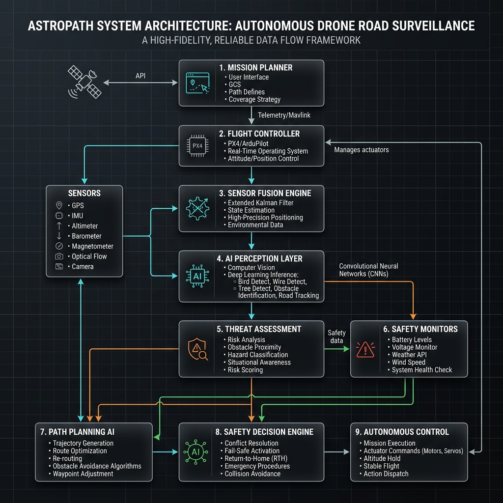
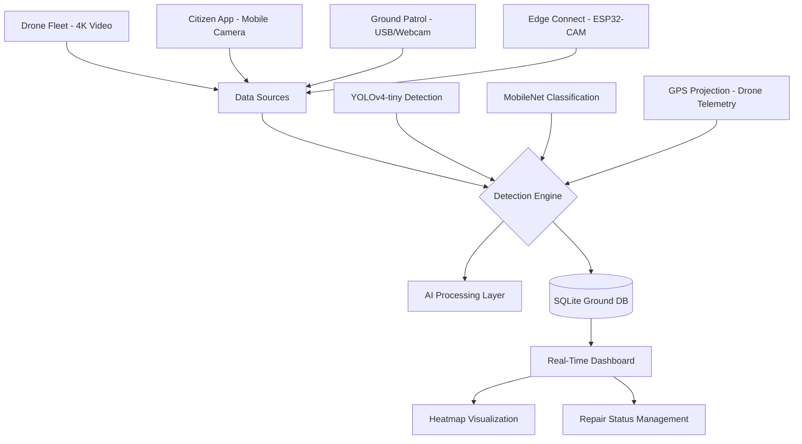

# 🚀 ASTROPATH: Automated Smart Technology for Road Observation, Planning, Analysis, Tracking & Healing

ASTROPATH is an end-to-end autonomous AI and IoT ecosystem designed to automate the lifecycle of urban road damage detection, severity classification, and rapid maintenance reporting. By fusing **Autonomous Aerial Drones (PX4/ArduPilot)**, **Edge AI Devices (ESP32-CAM/Raspberry Pi)**, and **Mobile Citizen Portals**, ASTROPATH builds a real-time, high-accuracy digital twin of municipal road infrastructure.

[](LICENSE)
[]()
[]()
[](https://astropath-0yd4.onrender.com)

---

## 📌 Table of Contents
1. [🌟 Interface & System Showcase](#-interface--system-showcase)
2. [💡 The Project Vision](#-the-project-vision)
3. [🏗️ System Architecture](#%EF%B8%8F-system-architecture)
4. [🛰️ Functional Layer Breakdown](#%EF%B8%8F-functional-layer-breakdown)
5. [💻 Tech Stack](#-tech-stack)
6. [🚀 Quick Start (30 Seconds!)](#-quick-start-30-seconds)
7. [📂 Codebase Structure](#-codebase-structure)
8. [🔧 Edge & Hardware Configuration](#-edge--hardware-configuration)
9. [🚁 Drone & Mission Controller Integration](#-drone--mission-controller-integration)
10. [📊 RESTful API Specifications](#-restful-api-specifications)
11. [🤝 Contribution & Code Standards](#-contribution--code-standards)
12. [👥 Team & Contact](#-team--contact)
13. [📄 License](#-license)

---

## 🌟 Interface & System Showcase

### 📊 High-Tech Real-Time Dashboard
A centralized control room interface providing real-time AI computer vision feeds, Leaflet.js interactive maps for spatial analysis, automatic hotspot heatmaps, and repair order tracking.


### 🚁 Autonomous Drone HUD & Edge Perception
A representation of the drone's aerial telemetry overlay and computer vision engine dynamically scanning for potholes, calculating real-world GPS coordinates, and reporting severity values.


---

## 💡 The Project Vision

### ⚠️ The Problem
Traditional road maintenance relies on reactive citizen complaints or manual vehicle patrols. These methods suffer from:
*   **Fatal Safety Hazards:** Undetected potholes cause severe accidents, pedestrian injuries, and millions in vehicle damage daily.
*   **Escalating Infrastructure Costs:** Postponing repairs increases costs exponentially; a minor crack left unmanaged grows 10x in cost and repair complexity.
*   **Disruptive Traffic Congestion:** Repair schedules are rarely predictive, leading to unplanned road closures during peak commuting hours.

### 💡 The Solution: ASTROPATH
ASTROPATH automates the observation and management cycle by integrating multi-source inputs:
1.  **Autonomous Aerial Patrols:** Drones cover wide areas 20x faster than ground crews, streaming feeds and telemetric data.
2.  **Edge-AI Ground Ingestion:** Low-power edge processors (ESP32-CAM) mounted on municipal transit vehicles scan roads dynamically.
3.  **Crowdsourced Reports:** Citizen web applications allow residents to log geolocated pothole reports directly.

---

## 🏗️ System Architecture

### 1. Functional System Flow
The logical pipeline of ASTROPATH flows from destination planning and drone execution down to threat classification, safety oversight, and mission execution:

```
                    ┌─────────────────────┐
                    │   Mission Planner   │
                    │ (Destination Input) │
                    └──────────┬──────────┘
                               │
                               ▼
                    ┌─────────────────────┐
                    │  Flight Controller  │
                    │ (PX4/ArduPilot)     │
                    └──────────┬──────────┘
                               │
        ┌──────────────────────┼──────────────────────┐
        ▼                      ▼                      ▼

┌──────────────┐     ┌────────────────┐     ┌──────────────┐
│ GPS Module   │     │ IMU Sensors    │     │ Altimeter    │
│ Location     │     │ Orientation    │     │ Height Data  │
└──────┬───────┘     └──────┬─────────┘     └──────┬───────┘
       │                    │                      │
       └────────────┬───────┴──────────────┬───────┘
                    ▼                      ▼

            ┌──────────────────────────────┐
            │    Sensor Fusion Engine      │
            │  (Kalman Filter / AI Model)  │
            └──────────────┬───────────────┘
                           │
                           ▼

            ┌──────────────────────────────┐
            │ Environment Perception Layer │
            └──────────────┬───────────────┘
                           │
      ┌────────────────────┼────────────────────┐
      ▼                    ▼                    ▼

┌──────────────┐   ┌──────────────┐   ┌──────────────┐
│ Bird Detect  │   │ Wire Detect  │   │ Tree Detect  │
│ AI Vision    │   │ AI Vision    │   │ AI Vision    │
└──────┬───────┘   └──────┬───────┘   └──────┬───────┘
       │                  │                  │
       └──────────┬───────┴──────────┬───────┘
                  ▼                  ▼

         ┌───────────────────────────┐
         │ Obstacle Classification   │
         │ & Threat Assessment       │
         └─────────────┬─────────────┘
                       │
                       ▼

         ┌───────────────────────────┐
         │ Dynamic Path Planning AI  │
         │ (ASTROPATH Core Engine)   │
         └─────────────┬─────────────┘
                       │
      ┌────────────────┼────────────────┐
      ▼                ▼                ▼

┌─────────────┐ ┌─────────────┐ ┌─────────────┐
│ Route       │ │ Re-routing  │ │ Emergency   │
│ Optimization│ │ Engine      │ │ Landing AI  │
└──────┬──────┘ └──────┬──────┘ └──────┬──────┘
       │               │               │
       └───────────────┼───────────────┘
                       ▼

         ┌───────────────────────────┐
         │ Battery & Weather Monitor │
         └─────────────┬─────────────┘
                       │
         ┌─────────────┼─────────────┐
         ▼             ▼             ▼

   Low Battery      Heavy Rain     High Wind
         │             │             │
         └─────────────┼─────────────┘
                       ▼

         ┌───────────────────────────┐
         │ Safety Decision Engine    │
         └─────────────┬─────────────┘
                       │
                       ▼

         ┌───────────────────────────┐
         │ Autonomous Flight Control │
         └─────────────┬─────────────┘
                       │
                       ▼

         ┌───────────────────────────┐
         │ Delivery / Mission Target │
         └───────────────────────────┘
```

### 2. Physical Deployment Architecture
This diagram outlines how data is ingested, processed, stored, and visualised:



### 3. Pipeline Flow Chart (Mermaid)

```mermaid
graph TD
    A[Data Sources] --> B{Detection Engine}
    A1[Drone Fleet - 4K Video] --> A
    A2[Citizen App - Mobile Camera] --> A
    A3[Ground Patrol - USB/Webcam] --> A
    A4[Edge Connect - ESP32-CAM] --> A
    
    B --> C[AI Processing Layer]
    C1[YOLOv4-tiny Detection] --> B
    C2[MobileNet Classification] --> B
    C3[GPS Projection - Drone Telemetry] --> B
    
    B --> D[(SQLite Ground DB)]
    D --> E[Real-Time Dashboard]
    E --> F[Heatmap Visualization]
    E --> G[Repair Status Management]
```

---

## 🛰️ Functional Layer Breakdown

### 1. Ingestion Layer
*   **Edge Connect (ESP32-CAM):** Operates on standard Wi-Fi micro-networks to stream frame payloads over HTTP/MJPEG protocols.
*   **Web Portal Uploads:** Citizens snap photos on their mobile devices; modern geolocation APIs query local device GPS and attach high-accuracy coordinates to the report.
*   **Aerial RTSP Streams:** Receives real-time video feeds from drone cameras via RTSP or UDP connections.

### 2. Computer Vision & Perception Layer
*   **YOLOv4-Tiny Model:** Analyzes 20-30 frames per second on typical hardware, outputting precise bounding boxes enclosing road defects.
*   **MobileNetV2 Classifier:** Validates detections, filters out false positives, and estimates pothole volume to determine repair priority (Low, Medium, High).
*   **Spatial Telemetry Projection:** Translates drone elevation, tilt, and gimbal angle into exact ground coordinates for potholes.

### 3. Safety Decision Engine
*   **Autonomous Safety Routing:** The flight manager continuously monitors atmospheric conditions (high winds, heavy rain) and battery status.
*   **Emergency Return-to-Home (RTH):** Automatically takes over flight operations to trigger safe emergency landings if thresholds are breached, preventing hardware losses.

---

## 💻 Tech Stack

*   **Backend Application:** Python 3.8+, Flask Framework, Waitress (WSGI server for production)
*   **Frontend UI:** HTML5, CSS3 (Modern Dark-Mode Grid/Flexbox Layout), Vanilla JavaScript
*   **Mapping & Spatial Analytics:** Leaflet.js, Leaflet.heat (Heatmap tracking)
*   **Computer Vision Frameworks:** OpenCV (cv2), Darknet YOLOv4-tiny, TensorFlow Lite / Keras (MobileNetV2 classification)
*   **Telemetry & Autonomous Flight:** Pymavlink, DroneKit API (for ArduPilot/PX4 simulated or physical communication)
*   **Storage & Database:** SQLite3 database engine
*   **Deployment Configuration:** Docker, Docker Compose, Render blueprints

---

## 🚀 Quick Start (30 Seconds!)

### Windows
```powershell
.\start.ps1
```

### Linux/Mac
```bash
chmod +x start.sh
./start.sh
```

**Accessing the Dashboard:**
*   Local Web Portal: [http://localhost:5000](http://localhost:5000)
*   Municipal Dashboard: [http://localhost:5000/dashboard](http://localhost:5000/dashboard)

---

## 📂 Codebase Structure

```
ASTROPATH/
├── assets/                 # High-fidelity project screenshots and diagrams
├── src/                    # Source files implementing application modules
│   ├── detect_edge.py      # Core OpenCV/YOLO edge processing pipelines
│   ├── drone_detector.py   # Telemetry parsing & aerial video processing
│   ├── drone_controller.py # Drone MAVLink commands & flight control wrapper
│   ├── gps_handler.py      # Serial/USB GPS parsing (NMEA decoding)
│   ├── database.py         # SQLite connection, migration, & query layer
│   ├── citizen_upload.py   # Citizen report ingestion & image compression
│   └── esp32_camera.py     # Network stream fetcher for ESP32-CAM edge boards
├── templates/              # HTML layout components
│   ├── index.html          # Main live feed & reporting interface
│   └── dashboard.html      # Leaflet map visualization dashboard
├── static/                 # Static front-end assets
│   ├── css/style.css       # Premium, responsive dark-mode stylesheet
│   └── js/                 # Client-side map & websocket controller logic
├── models/                 # Neural network config & weights files
│   ├── yolov4-tiny.cfg     # YOLOv4-tiny layer definition
│   └── obj.names           # Class labels (e.g., pothole)
├── app.py                  # Main web application entry point
├── main.py                 # CLI interface menu for diagnostic scripts
├── config.py               # Centralized configuration parameters
├── requirements.txt        # Python dependency manifest
├── Dockerfile              # Docker container configuration
└── docker-compose.yml      # Multi-container service definitions
```

---

## 🔧 Edge & Hardware Configuration

### 1. ESP32-CAM Setup
The ESP32-CAM serves as a low-cost, edge-deployed camera unit.
1.  Navigate to `hardware/esp32_cam/` and upload the provided sketch to your ESP32 board using the Arduino IDE.
2.  Once connected to your local Wi-Fi network, the ESP32 serial console will output its local streaming IP (e.g., `http://192.168.1.55:81/stream`).
3.  Open `config.py` and modify the following value:
    ```python
    CAMERA_SOURCE = "http://192.168.1.55:81/stream"
    ```

### 2. GPS NEO-6M Integration
To mount a serial GPS receiver on a ground patrol vehicle:
1.  Connect the GPS module's TX/RX pins to your PC using a USB-to-TTL converter.
2.  Update `config.py` to enable the serial reader:
    ```python
    GPS_ENABLED = True
    GPS_PORT = "COM3"  # On Linux, use "/dev/ttyUSB0"
    ```
3.  Run diagnostics: `python test_gps.py` to confirm NMEA coordinates are parsing correctly.

---

## 🚁 Drone & Mission Controller Integration

ASTROPATH interfaces with flight controllers running PX4 or ArduPilot firmware to orchestrate autonomous flight profiles.

### Telemetry Connection
The system connects to physical or simulated flight systems using MAVLink over serial or UDP connections:

```python
# config.py
DRONE_ENABLED = True
DRONE_CONNECTION_STRING = "127.0.0.1:14550"  # Local SITL or telemetry radio
DRONE_STREAM_URL = "rtsp://192.168.1.100:8554/live"
```

To run a simulated mission alongside the telemetry pipeline:
1. Run your ArduPilot SITL simulator.
2. Test the telemetric stream parser:
   ```bash
   python test_drone_stream.py
   ```
3. Run the aerial surveyor:
   ```bash
   python src/drone_detector.py
   ```

*For step-by-step guidance on setting up flight simulators, read [DRONE_GUIDE.md](DRONE_GUIDE.md).*

---

## 📊 RESTful API Specifications

| Method | Endpoint | Description | Sample Response Payload |
|:---|:---|:---|:---|
| **GET** | `/health` | Ingestion layer health check | `{"status": "healthy", "gpu_available": false}` |
| **GET** | `/api/detections` | Retrieve registered road defects | `[{"id": 12, "latitude": 17.65, "severity": "High"}]` |
| **GET** | `/api/stats` | Aggregated telemetry & count statistics | `{"total_potholes": 84, "high_severity": 19}` |
| **POST**| `/api/upload` | Upload citizen-submitted road defect | `{"status": "success", "detection_id": 232}` |

### Sample Citizen Reporting Request
```python
import requests

url = "http://localhost:5000/api/upload"
payload = {
    "latitude": "17.6682",
    "longitude": "75.9015",
    "severity": "High"
}
files = {
    "image": ("defect.jpg", open("defect.jpg", "rb"), "image/jpeg")
}

response = requests.post(url, data=payload, files=files)
print(response.json())
```

---

## 🤝 Contribution & Code Standards

We welcome contributions from researchers, smart-city engineers, and students!
1.  Fork the repository.
2.  Create a feature branch (`git checkout -b feature/AmazingFeature`).
3.  Ensure your code conforms to PEP-8 guidelines.
4.  Commit your modifications (`git commit -m 'Add AmazingFeature'`).
5.  Push your branch (`git push origin feature/AmazingFeature`) and open a Pull Request.

---

## 👥 Team & Contact

*   **Lead Developer:** Mallu Diswardhan Reddy  
*   **Email:** [438malludiswardhanreddy@gmail.com](mailto:438malludiswardhanreddy@gmail.com)  
*   **Organization:** Solapur Municipal Corporation (Smart City Initiative)

---

## 📄 License

This project is licensed under the MIT License - see the [LICENSE](LICENSE) file for details.

---
**Designed to make urban infrastructure safer, smarter, and more resilient. 🚗 📱 🚁**
