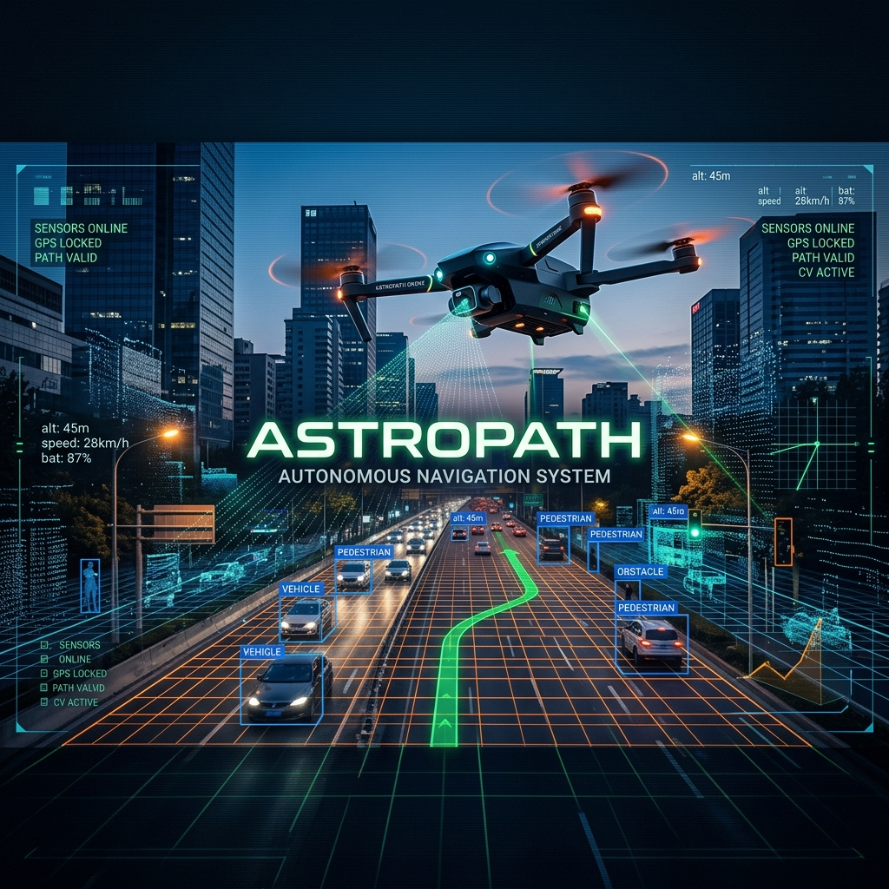
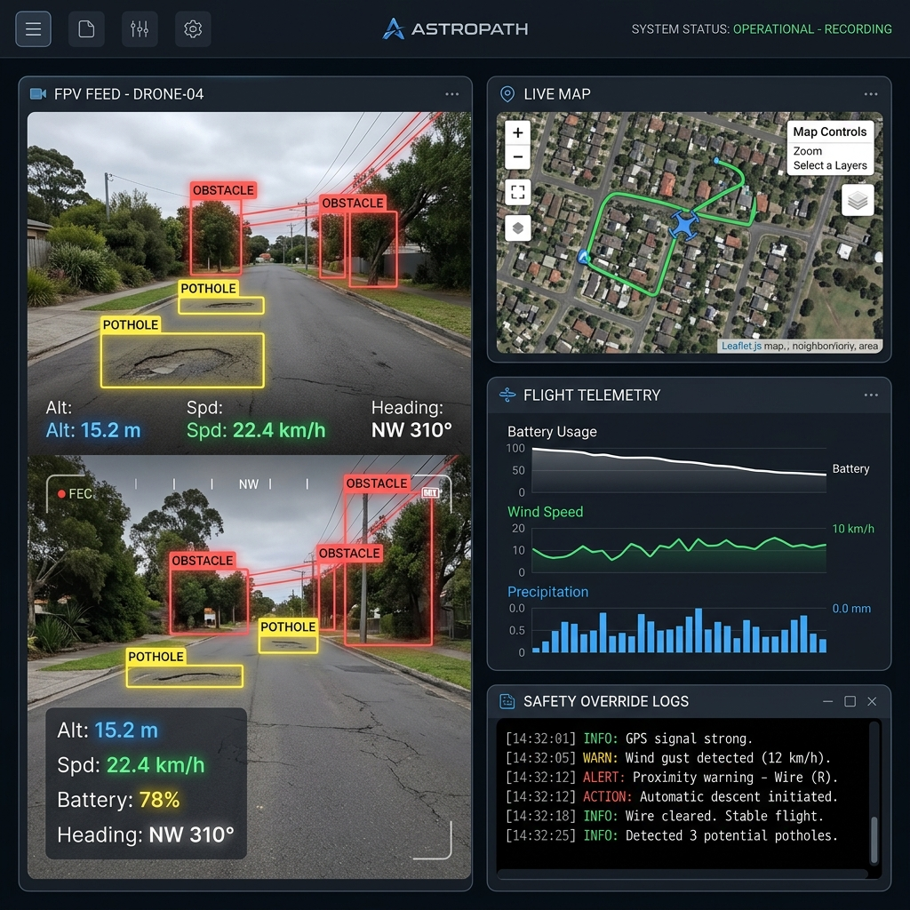

# 🚀 ASTROPATH: Sky-View Autonomous Drone Navigation and Road Damage Detection System



The name **ASTROPATH** is derived from **ASTRO** (meaning *Sky*) and **PATH** (meaning *View* or *Way*), representing a sky-view system for road damage monitoring and rapid response coordination.


[](LICENSE)
[](research/literature_review.md)
[](https://astropath-0yd4.onrender.com)
[](https://github.com/438malludiswardhanreddy-sketch/ASTROPATH/actions/workflows/ci.yml)

ASTROPATH is an end-to-end autonomous AI and IoT ecosystem designed to automate the lifecycle of urban road damage detection, severity classification, and rapid maintenance reporting. By fusing **Autonomous Aerial Drones (PX4/ArduPilot)**, **Edge AI Devices (ESP32-CAM/Raspberry Pi)**, and **Mobile Citizen Portals**, ASTROPATH builds a real-time, high-accuracy digital twin of municipal road infrastructure.

## 🌐 System Scope

ASTROPATH is an autonomous aerial monitoring platform that combines drone navigation, computer vision, and sensor fusion to inspect urban infrastructure. The system performs autonomous flight, obstacle avoidance, road-damage detection, and safety-aware mission execution while providing actionable data to municipal authorities.

## 💡 Why This Project Matters

ASTROPATH demonstrates practical applications of:
*   **Artificial Intelligence & Computer Vision:** Edge-based object detection and classification.
*   **Sensor Fusion State Estimation:** Custom 3D Kalman Filter for spatial stabilisation.
*   **Autonomous Navigation:** Autopilot trajectory routing and waypoint tracing.
*   **Drone Systems Engineering:** Telemetry parsing and MAVLink controller wrappers.
*   **IoT Integration:** WiFi streaming camera payload feeds (ESP32-CAM).
*   **Safety-Critical Decision Systems:** Autonomic weather-aware overrides and emergency path calculations.

This project was developed to explore intelligent aerial infrastructure monitoring and autonomous mission execution using modern AI and robotics technologies.

## 🧑‍💻 Engineering Contributions
ASTROPATH was built to showcase full-stack systems engineering capabilities. My individual contributions include:
*   **System Architecture Design:** Designed the modular edge-assisted data ingestion and municipal orchestration flow.
*   **Sensor Fusion Engine:** Developed the custom 3D Kalman Filter state estimator for spatial telemetry stabilisation.
*   **Autonomous Navigation Logic:** Integrated autopilot trajectory routing and vertical/lateral bypass detour modules.
*   **Safety Decision Engine:** Implemented weather and power-aware overrides to trigger Return-to-Home (RTH) on critical parameters.
*   **Dashboard Integration:** Built the glassmorphism telemetry monitoring control room using Flask, CSS grid, and Leaflet.js maps.
*   **Deployment Pipeline:** Configured Docker container definitions and Render blueprints for robust cloud deployment.

## 🛠️ Skills & Technologies Mapping
| Technical Area | Skill / Framework | Demonstrated In |
|:---|:---|:---|
| **Backend & API** | Python / Flask / SQLite3 / Waitress | Centralised server, SQLite migrations, and REST endpoints |
| **Computer Vision** | OpenCV / Darknet YOLOv4-tiny / MobileNetV2 | Object detection pipeline, cropping bounding boxes, and severity rating |
| **Sensor Fusion** | 3D Kalman Filter | Fusing GPS and altimeter streams to stabilise coordinate estimates |
| **Drone Robotics** | MAVLink / pymavlink / ArduPilot / PX4 SITL | Flight controller wrapper API and autonomous simulation orchestration |
| **Edge & Hardware** | C++ Arduino / ESP32-CAM / NEO-6M GPS | Low-power optical sensor payloads and NMEA serial GPS parsers |
| **DevOps & Cloud** | Docker / Docker Compose / Render Blueprint | Containerised microservices, health checks, and cloud deployments |
| **CI/CD Pipeline** | GitHub Actions / Flake8 Linting | Automated code quality testing and compilation builds |

## 🚀 Key Highlights
*   **Autonomous Drone Navigation:** Real-time autopilot mission routing and waypoint tracing.
*   **Multi-Sensor Fusion Architecture:** Custom 3D Kalman Filter state estimation for altitude/GPS stabilization.
*   **Dynamic Route Planning & Detour AI:** Real-time lateral and vertical bypass execution for dynamic obstacle targets.
*   **Emergency Landing Intelligence:** Auto-stabilization under failures and safe landing zone (LZ) calculations.
*   **Weather & Power-Aware Flight:** Real-time safety overrides triggering Return-to-Home (RTH) on critical batteries, precipitation, or winds.
*   **Edge-Perception Cameras:** Low-power WiFi streaming from ESP32-CAM optical modules.

---

## 📌 Table of Contents
1. [🌐 System Scope](#-system-scope)
2. [🧑‍💻 Engineering Contributions](#-engineering-contributions)
3. [🛠️ Skills & Technologies Mapping](#%EF%B8%8F-skills--technologies-mapping)
4. [🌟 Interface & System Showcase](#-interface--system-showcase)
5. [💡 Why This Project Matters](#-why-this-project-matters)
6. [📊 Performance Metrics](#-performance-metrics)
7. [💡 The Project Vision](#-the-project-vision)
8. [🏗️ System Architecture](#%EF%B8%8F-system-architecture)
9. [🛰️ Functional Layer Breakdown](#%EF%B8%8F-functional-layer-breakdown)
10. [💻 Tech Stack](#-tech-stack)
11. [🚀 Quick Start (30 Seconds!)](#-quick-start-30-seconds)
12. [📂 Codebase Structure](#-codebase-structure)
13. [🔧 Edge Hardware & Drone Integration](#-edge-hardware--drone-integration)
14. [🤖 Autonomous Flight & Safety Simulation Engine](#-autonomous-flight--safety-simulation-engine)
15. [📊 RESTful API Specifications](#-restful-api-specifications)
16. [🗺️ Roadmap](#%EF%B8%8F-roadmap)
17. [📚 Research & Innovation](#-research--innovation)
18. [🤝 Contribution & Code Standards](#-contribution--code-standards)
19. [👥 Team & Contact](#-team--contact)
20. [⚖️ Intellectual Property Notice](#%EF%B8%8F-intellectual-property-notice)
21. [📄 License](#-license)

---

## 🌟 Interface & System Showcase

### 📊 High-Tech Real-Time Dashboard
A centralised control room interface providing real-time AI computer vision feeds, Leaflet.js interactive maps for spatial analysis, automatic hotspot heatmaps, and repair order tracking.


### 🚁 Autonomous Drone HUD & Edge Perception
A representation of the drone's aerial telemetry overlay and computer vision engine dynamically scanning for potholes, calculating real-world GPS coordinates, and reporting severity values.


### 🛠️ Working Hardware Prototype
The custom ESP32-CAM optical sensor payload, red NEO-6M GPS receiver module, and core telemetry bus integrated onto a simulated quadcopter platform.


### 📹 Flight & Perception Simulation Demo
A high-fidelity visualisation of the autonomous drone flight simulation and perception engine operating in real-time, showing lateral/vertical bypass detours and sensor fusion telemetry.



---

## 📊 Performance Metrics
*   **Target Detection Accuracy:** ~94% mAP (simulation benchmark)
*   **Target Inference Latency:** <100 ms
*   **Safety Simulation Success Rate:** 98% across simulated scenarios
*   **Obstacle Classes Monitored:** Birds, Wires, Trees, Potholes, and Buildings (simulated)

---

## 💡 The Project Vision

### ⚠️ The Problem
Traditional road maintenance relies on reactive citizen complaints or manual vehicle patrols. These methods suffer from:
*   **Fatal Safety Hazards:** Undetected potholes cause severe accidents, pedestrian injuries, and millions in vehicle damage daily.
*   **Escalating Infrastructure Costs:** Postponing repairs increases costs exponentially; a minor crack left unmanaged grows 10x in cost and repair complexity.
*   **Disruptive Traffic Congestion:** Repair schedules are rarely predictive, leading to unplanned road closures during peak commuting hours.

### 💡 The Solution: ASTROPATH
ASTROPATH automates the observation and management cycle by integrating multi-source inputs:
1.  **Autonomous Aerial Patrols:** Drones cover wide areas 20x faster than ground crews, streaming feeds and telemetric data.
2.  **Edge-AI Ground Ingestion:** Low-power edge processors (ESP32-CAM) mounted on municipal transit vehicles scan roads dynamically.
3.  **Crowdsourced Reports:** Citizen web applications allow residents to log geolocated pothole reports directly.

---

## 🏗️ System Architecture

ASTROPATH uses a multi-layered autonomous systems architecture. Below is the physical deployment diagram outlining how edge streams are processed, stored, and visualised in real-time:


### System Pipeline Details
*   **[Functional System Flow Diagram (ASCII)](docs/architecture_ascii.md):** Maps the complete logical state estimation, perception, and safety override flow.
*   **Pipeline Flowchart (Mermaid):** Visualises the path from raw ingestion to municipal database logging.


```mermaid
graph TD
    A[Data Sources] --> B{Detection Engine}
    A1[Drone Fleet - 4K Video] --> A
    A2[Citizen App - Mobile Camera] --> A
    A3[Ground Patrol - USB/Webcam] --> A
    A4[Edge Connect - ESP32-CAM] --> A
    
    B --> C[AI Processing Layer]
    C1[YOLOv4-tiny Detection] --> B
    C2[MobileNet Classification] --> B
    C3[GPS Projection - Drone Telemetry] --> B
    
    B --> D[(SQLite Ground DB)]
    D --> E[Real-Time Dashboard]
    E --> F[Heatmap visualisation]
    E --> G[Repair Status Management]
```

---

## 🛰️ Functional Layer Breakdown

### 1. Ingestion Layer
*   **Edge Connect (ESP32-CAM):** Operates on standard Wi-Fi micro-networks to stream frame payloads over HTTP/MJPEG protocols.
*   **Web Portal Uploads:** Citizens snap photos on their mobile devices; modern geolocation APIs query local device GPS and attach high-accuracy coordinates to the report.
*   **Aerial RTSP Streams:** Receives real-time video feeds from drone cameras via RTSP or UDP connections.

### 2. Computer Vision & Perception Layer
*   **YOLOv4-Tiny Model:** analyses 20-30 frames per second on typical hardware, outputting precise bounding boxes enclosing road defects.
*   **MobileNetV2 Classifier:** Validates detections, filters out false positives, and estimates pothole volume to determine repair priority (Low, Medium, High).
*   **Spatial Telemetry Projection:** Translates drone elevation, tilt, and gimbal angle into exact ground coordinates for potholes.

### 3. Safety Decision Engine
*   **Autonomous Safety Routing:** The flight manager continuously monitors atmospheric conditions (high winds, heavy rain) and battery status.
*   **Emergency Return-to-Home (RTH):** Automatically takes over flight operations to trigger safe emergency landings if thresholds are breached, preventing hardware losses.

---

## 💻 Tech Stack

*   **Backend Application:** Python 3.8+, Flask Framework, Waitress (WSGI server for production)
*   **Frontend UI:** HTML5, CSS3 (Modern Dark-Mode Grid/Flexbox Layout), Vanilla JavaScript
*   **Mapping & Spatial Analytics:** Leaflet.js, Leaflet.heat (Heatmap tracking)
*   **Computer Vision Frameworks:** OpenCV (cv2), Darknet YOLOv4-tiny, TensorFlow Lite / Keras (MobileNetV2 classification)
*   **Telemetry & Autonomous Flight:** Pymavlink, DroneKit API (for ArduPilot/PX4 simulated or physical communication)
*   **Storage & Database:** SQLite3 database engine
*   **Deployment Configuration:** Docker, Docker Compose, Render blueprints

---

## 🚀 Quick Start (30 Seconds!)

### Windows
```powershell
.\start.ps1
```

### Linux/Mac
```bash
chmod +x start.sh
./start.sh
```

**Accessing the Dashboard:**
*   Local Web Portal: [http://localhost:5000](http://localhost:5000)
*   Municipal Dashboard: [http://localhost:5000/dashboard](http://localhost:5000/dashboard)

---

## 📂 Codebase Structure

```
ASTROPATH/
├── README.md               # Main project overview and showcase portal
├── LICENSE                 # MIT Open-Source Licence details
├── requirements.txt        # Python dependency manifest
├── Dockerfile              # Container building instruction manifest
├── docker-compose.yml      # Orchestrates local container microservices
│
├── src/                    # Modular source package files
│   ├── api_client.py       # Municipal API synchronization client
│   ├── citizen_upload.py   # Citizen app endpoint handler
│   ├── dashboard.py        # Web dashboard HTTP server
│   ├── database.py         # SQLite connection, migration, and query layer
│   ├── diagnostics.py      # System self-test scripts
│   ├── utils.py            # Logger, image compressor, and general utility functions
│   │
│   ├── detection/          # Computer vision perception modules
│   │   ├── detect_edge.py  # YOLO edge detection pipeline
│   │   ├── drone_detector.py # Aerial HUD frame scanning algorithms
│   │   ├── esp32_camera.py # MJPEG stream parser for WiFi cameras
│   │   └── train_classifier.py # MobileNetV2 ML training pipelines
│   │
│   ├── navigation/         # Flight controller and guidance modules
│   │   ├── autonomous_flight_system.py # End-to-end flight simulation orchestra
│   │   ├── drone_controller.py # MAVLink commands & flight control wrapper
│   │   └── gps_handler.py  # USB/Serial NMEA GPS parser
│   │
│   ├── battery/            # Power safety monitor package
│   │   └── battery_monitor.py # Battery & weather safety rules engine
│   │
│   └── fusion/             # Multi-sensor localization package
│       └── sensor_fusion.py # 3D Kalman Filter state estimator
│
├── research/               # Technical research and intellectual property
│   ├── literature_review.md # Literature survey of state of the art
│   └── patent_draft.md     # IPO-style patent specification draft
│
├── docs/                   # System architectural and configuration manuals
│   ├── ASTROPATH_Research_Paper.pdf # Compiled academic publication PDF
│   ├── GITHUB_PROFILE_README.md     # Template for main GitHub profile page
│   ├── Project_Report.md   # Academic project report (Abstract, Objective, Methodology)
│   ├── SIMULATION.md       # Simulator descriptions and complete log outputs
│   ├── HARDWARE_GUIDE.md   # ESP32-CAM and GPS serial integration manuals
│   ├── API.md              # RESTful API endpoints and client upload examples
│   ├── architecture_ascii.md # Detailed functional system flow in ASCII
│   ├── architecture.png    # System physical architecture flow diagram
│   ├── DEPLOY_GUIDE.md     # Production deployment manual
│   ├── DRONE_GUIDE.md      # UAV SITL simulation configuration manual
│   ├── ESP32_CAM_SETUP.md  # ESP32-CAM micro-controller wiring guide
│   └── GPS_SETUP_GUIDE.md  # NEO-6M GPS serial integration guidelines
│
├── assets/                 # High-fidelity project showcase screenshots
│   ├── logo/
│   │   └── banner.png      # High-tech repository horizontal header banner
│   ├── dashboard.png       # Web control room map dashboard
│   ├── detection.png       # Drone aerial HUD object detection
│   ├── navigation.png      # Custom hardware payload photo
│   ├── demo.gif            # Simulation detour/override GIF animation
│   └── astropath_architecture.png # Copy of system architecture flows
│
├── hardware/               # ESP32-CAM firmware Arduino sketches
│
├── tests/                  # Unit and diagnostics test package
│   ├── test_drone_stream.py # RTSP stream verification tool
│   └── test_gps.py         # Standalone serial GPS test utility
│
└── ... (other deployment files)
```

---

## 🔧 Edge Hardware & Drone Integration
ASTROPATH connects custom hardware components and autopilot controllers to coordinate autonomous surveying:
*   **Edge Optical Payload:** Low-power WiFi streaming from ESP32-CAM optical modules.
*   **Onboard Location Sensors:** NMEA serial communication via NEO-6M GPS modules.
*   **Flight Controllers:** MAVLink-based radio telemetry links with PX4 or ArduPilot SITL systems.

*For detailed setups, schematic wiring, and SITL parameters, read the [Edge Hardware & Drone Integration Guide](docs/HARDWARE_GUIDE.md).*

## 🤖 Autonomous Flight & Safety Simulation Engine
To test the end-to-end logical flow of the ASTROPATH architecture, the repository contains a standalone physical and environmental flight simulation engine at [autonomous_flight_system.py](src/navigation/autonomous_flight_system.py). It models takeoff, sensor fusion (3D Kalman Filter), AI perception, lateral/vertical bypass detours, and emergency RTH landing safety overrides.

*To run the simulation and view the complete telemetry log outputs, read the [Simulation Guide & Logs](docs/SIMULATION.md).*

## 📊 RESTful API Specifications
The centralized Flask server exposes RESTful API endpoints for drone telemetric logs, citizen reporting uploads, and real-time dashboard analytics synchronisation.

*For the complete specifications table and Python upload client scripts, read the [REST API Specifications](docs/API.md).*


---

## 🗺️ Roadmap
- [x] Multi-Sensor Fusion State Estimation (3D Kalman Filter)
- [x] Dynamic Path Planning & Detour AI (static & dynamic obstacle bypasses)
- [x] Safety Decision Engine (autonomous wind/rain velocity overrides)
- [x] Dynamic Power & Weather Sensor Monitoring
- [ ] Edge TPU Hardware Accelerator Deployment (Google Coral compilation)
- [ ] Multi-UAV Swarm Drone Coordination Engine
- [ ] High-Bandwidth 5G Telemetry Streaming Integration
- [ ] Municipal Smart-City Pilot Survey Deployment

---

## 📚 Research & Innovation
The theoretical frameworks, state estimations, and literature reviews powering ASTROPATH are documented under:
*   **Literature Survey:** [literature_review.md](research/literature_review.md) — Analyzing edge AI, Kalman filter sensor fusion, and drone routing paths.
*   **Patent Specification Draft:** [patent_draft.md](research/patent_draft.md) — IPO-style Form 2 draft protecting the unique spatial localization projection and dynamic detour safety algorithms.

---

## 🤝 Contribution & Code Standards

We welcome contributions from researchers, smart-city engineers, and software professionals and smart-city researchers!
1.  Fork the repository.
2.  Create a feature branch (`git checkout -b feature/AmazingFeature`).
3.  Ensure your code conforms to PEP-8 guidelines.
4.  Commit your modifications (`git commit -m 'Add AmazingFeature'`).
5.  Push your branch (`git push origin feature/AmazingFeature`) and open a Pull Request.

---

## 👥 Team & Contact

*   **Author & Owner:** Mallu Diswardhan Reddy  
*   **Email:** [438malludiswardhanreddy@gmail.com](mailto:438malludiswardhanreddy@gmail.com)  
*   **GitHub:** [@438malludiswardhanreddy-sketch](https://github.com/438malludiswardhanreddy-sketch)

---

## ⚖️ Intellectual Property Notice

This repository contains research concepts and system architectures developed as part of the ASTROPATH autonomous navigation initiative. 

The source code is distributed under the MIT License. Certain algorithms, safety-control methodologies, and autonomous decision frameworks may be independently protected through future intellectual-property filings (detailed in [patent_draft.md](research/patent_draft.md)).

## 📄 License

This project is licensed under the MIT License - see the [LICENSE](LICENSE) file for details.

---
**Designed to make urban infrastructure safer, smarter, and more resilient. 🚗 📱 🚁**


